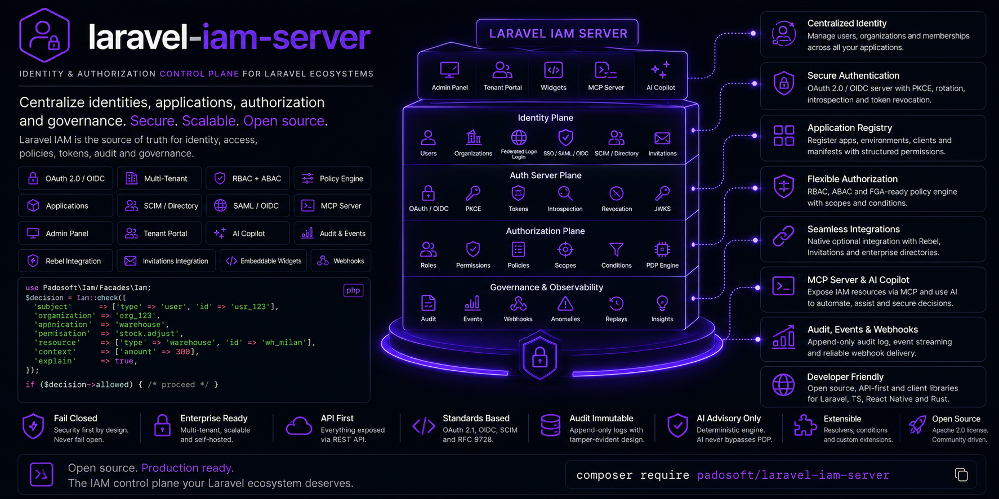

<p align="center">
  
</p>

<h1 align="center">Laravel IAM — Demo</h1>

<p align="center">
  <strong>A single Laravel app with the entire Laravel IAM ecosystem installed and wired.</strong><br>
  Server + client + AI + directory + Spatie bridge, booted together, full schema migrated.
</p>

<p align="center">
  <a href="https://github.com/padosoft/laravel-iam-demo/actions/workflows/tests.yml"></a>
  <a href="https://github.com/padosoft/laravel-iam-server"></a>
  
  
  <a href="LICENSE"></a>
</p>

---

## What this is

This is a **runnable reference app** that installs all six
[Laravel IAM](https://github.com/padosoft) packages at once and proves they boot, auto-register and migrate
together — the fastest way to see the whole control plane working end to end on your machine.

| Package | What it brings to the demo |
| --- | --- |
| [laravel-iam-contracts](https://github.com/padosoft/laravel-iam-contracts) | Shared interfaces & DTOs (the dependency root) |
| [laravel-iam-server](https://github.com/padosoft/laravel-iam-server) | Identity, PDP (RBAC+ABAC+ReBAC), OAuth/OIDC, audit, governance, Admin API |
| [laravel-iam-client](https://github.com/padosoft/laravel-iam-client) | `iam.auth` / `iam.can` middleware + Gate adapter for consuming apps |
| [laravel-iam-ai](https://github.com/padosoft/laravel-iam-ai) | Optional advisory-only AI governance (disabled by default) |
| [laravel-iam-directory](https://github.com/padosoft/laravel-iam-directory) | Optional LDAP/AD login + JIT provisioning |
| [laravel-iam-bridge-spatie-permission](https://github.com/padosoft/laravel-iam-bridge-spatie-permission) | Migration bridge from spatie/laravel-permission |

> **Topology.** For simplicity the demo runs the **server and a consuming client in one app**. In
> production you typically run the **server** as a standalone IdP/PDP and install only the **client** in each
> consuming app. The packages support both.

## Quick start

```bash
git clone https://github.com/padosoft/laravel-iam-demo
cd laravel-iam-demo

cp .env.example .env
composer install
php artisan key:generate
php artisan migrate          # creates the full IAM schema (SQLite by default)

php artisan serve
```

Then open **<http://localhost:8000/iam>** — a live introspection endpoint that lists the installed packages,
the registered `iam:*` artisan commands and the migrated `iam_*` tables, straight from the booted app:

```jsonc
{
  "app": "Laravel IAM — demo (all packages, single app)",
  "packages_installed": [ "padosoft/laravel-iam-contracts", "padosoft/laravel-iam-server", "..." ],
  "iam_artisan_commands": [ "iam:audit:verify", "iam:manifest:apply", "iam:spatie:scan", "..." ],
  "iam_tables_migrated":  [ "iam_applications", "iam_audit_events", "iam_grants", "..." ]
}
```

## How the packages are installed

All six packages are published on **[Packagist](https://packagist.org/packages/padosoft/)**, so they install
with a plain `composer require` — no custom `repositories`, no path/VCS links:

```jsonc
"require": {
  "padosoft/laravel-iam-server": "^1.0",
  "padosoft/laravel-iam-client": "^1.0"
  // …one per package, resolved straight from Packagist
}
```

Every internal `padosoft/laravel-iam-*` dependency is also resolved from Packagist (`^1.0`) — the packages
are fully independent, with no references back to a monorepo. And all six providers **auto-register** through
Laravel package discovery (run `php artisan package:discover` to see them), so there is **no manual
provider/config wiring** to install them.

## Explore it

```bash
# The full IAM command surface (audit, manifests, access reviews, least-privilege, Spatie migration…)
php artisan list iam

# Verify the tamper-evident audit hash-chain
php artisan iam:audit:verify --help

# Inventory an existing spatie/laravel-permission setup for migration
php artisan iam:spatie:scan --help
```

## Going further: protect a route with the PDP

The client package ships `iam.auth` (authenticated IAM subject) and `iam.can:<permission>` (PDP decision,
fail-closed). In `routes/web.php`:

```php
Route::middleware(['iam.auth', 'iam.can:invoices.view'])->group(function () {
    Route::get('/invoices', fn () => 'You may view invoices.');
});
```

Wiring a full authorization click-path needs an issuer + signing keys and some seeded grants — follow the
[server](https://github.com/padosoft/laravel-iam-server) and
[client](https://github.com/padosoft/laravel-iam-client) docs. The route block is included (commented) in
`routes/web.php`.

## Tested — the whole feature pack

This demo doubles as a **verification harness**: a feature-test suite that exercises every subsystem of the
ecosystem end to end, against the packages **as installed from Packagist** (no mocks, real classes, in-memory
SQLite). Run it with:

```bash
php artisan test
```

```
Tests:  58 passed (383 assertions)
```

| Suite | Covers |
| --- | --- |
| `PdpEngineTest` | default-deny, direct & RBAC grants, deny-overrides, deprecated perms, resource scope, ABAC conditions, tenant/app isolation, step-up/AAL |
| `GrantsAndRequestsTest` | time-boxed grants, revoke, PIM activation, and the self-service **access request → approval → grant → allow** flow |
| `GovernanceTest` | Access Review campaigns (certify/revoke/auto-revoke), FeatureScope cascade, least-privilege recommender (draft-only) |
| `AuditTest` | tamper-evident hash-chain, verify, tamper detection, ES256 checkpoints, SIEM export (CEF/OCSF/LEEF) |
| `CryptoAndSessionsTest` | envelope encryption, crypto-shredding, JWT ES256 + JWKS, revocable sessions (idle/absolute timeout), AAL |
| `DirectoryTest` | group mapping, JIT provisioning, anti-takeover, `protected_roles`, stale-grant revocation, fail-closed auth |
| `AiClientBridgeTest` | AI redaction / hallucination-guard / advisory-only-disabled, client deciders (fail-closed) + Gate adapter, Spatie scan/manifest/shadow-diff |
| `OAuthAndManifestTest` | manifest validate/apply/diff/rollback, OAuth access-token ES256+JWKS, introspection, refresh rotation + replay protection |

CI runs the full suite on PHP 8.3 and 8.4 on every push (see the badge above).

## Documentation

Each package ships its own docmd doc-site under `docs/`. Start with the
[server](https://github.com/padosoft/laravel-iam-server) (the control plane) and the
[client](https://github.com/padosoft/laravel-iam-client) (how apps consume it).

## License

MIT © [Padosoft](https://www.padosoft.com). The Laravel framework is also MIT licensed.
