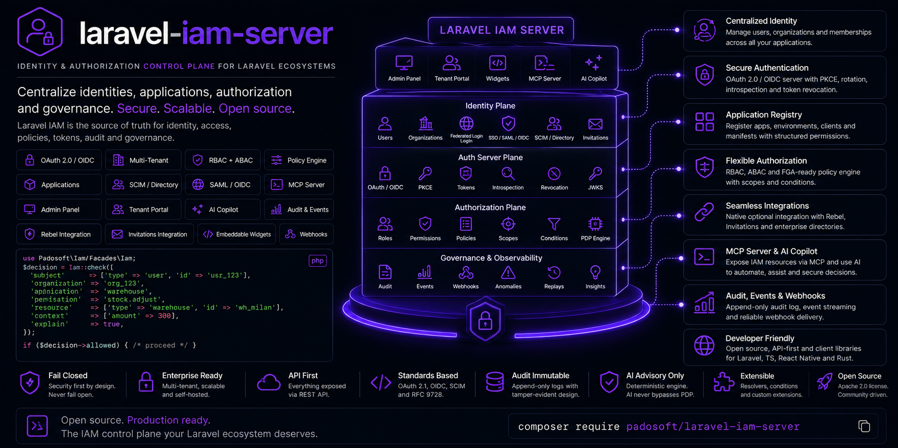
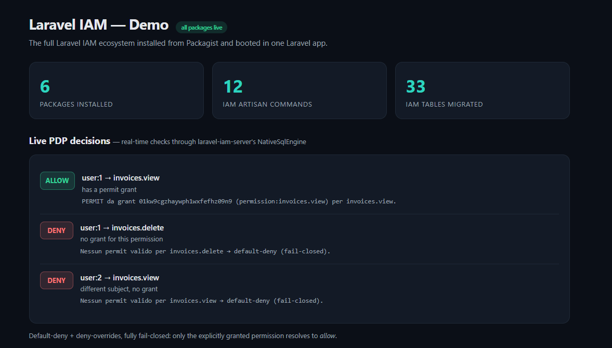
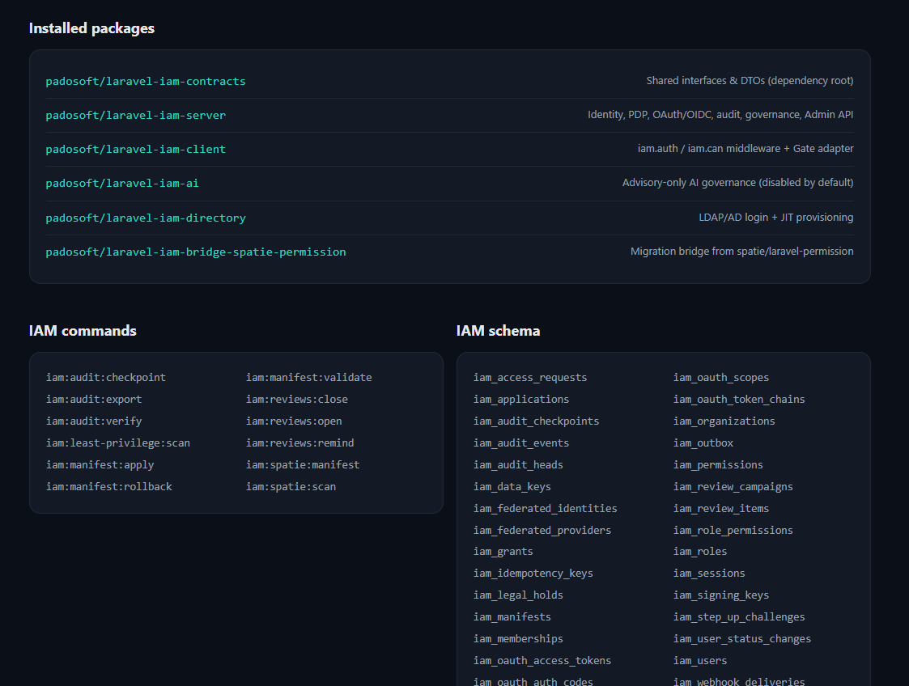
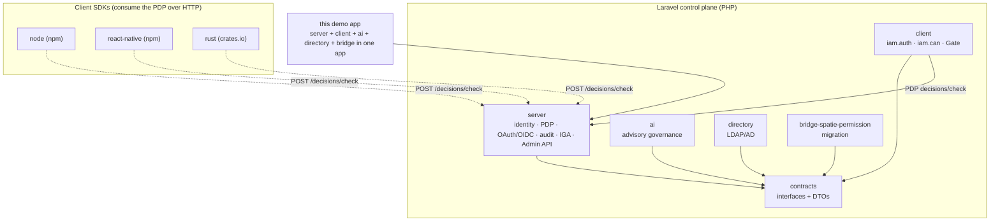

<p align="center">
  
</p>

<h1 align="center">Laravel IAM — Demo</h1>

<p align="center">
  <strong>A single Laravel app with the entire Laravel IAM ecosystem installed and wired.</strong><br>
  Server + client + AI + directory + Spatie bridge, booted together, full schema migrated.
</p>

<p align="center">
  <a href="https://github.com/padosoft/laravel-iam-demo/actions/workflows/tests.yml"></a>
  <a href="https://github.com/padosoft/laravel-iam-server"></a>
  
  
  <a href="LICENSE"></a>
</p>

---

## What this is

This is a **runnable reference app** that installs all seven
[Laravel IAM](https://github.com/padosoft) packages at once and proves they boot, auto-register and migrate
together — the fastest way to see the whole control plane working end to end on your machine.

| Package | What it brings to the demo |
| --- | --- |
| [laravel-iam-contracts](https://github.com/padosoft/laravel-iam-contracts) | Shared interfaces & DTOs (the dependency root) |
| [laravel-iam-server](https://github.com/padosoft/laravel-iam-server) | Identity, PDP (RBAC+ABAC+ReBAC), OAuth/OIDC, audit, governance, Admin API |
| [laravel-iam-client](https://github.com/padosoft/laravel-iam-client) | `iam.auth` / `iam.can` middleware + Gate adapter for consuming apps |
| [laravel-iam-ai](https://github.com/padosoft/laravel-iam-ai) | Optional advisory-only AI governance (disabled by default) |
| [laravel-iam-directory](https://github.com/padosoft/laravel-iam-directory) | Optional LDAP/AD login + JIT provisioning |
| [laravel-iam-bridge-spatie-permission](https://github.com/padosoft/laravel-iam-bridge-spatie-permission) | Migration bridge from spatie/laravel-permission |
| [laravel-iam-agents](https://github.com/padosoft/laravel-iam-agents) | Delegated access for AI agents: RFC 8693 exchange, intersection PDP, consent |

> **Topology.** For simplicity the demo runs the **server and a consuming client in one app**. In
> production you typically run the **server** as a standalone IdP/PDP and install only the **client** in each
> consuming app. The packages support both.

## See it running

The demo homepage makes **real PDP decisions live** — every `ALLOW`/`DENY` below is computed by
`laravel-iam-server`'s `NativeSqlEngine` (default-deny + deny-overrides, fully fail-closed):

<p align="center">
  
</p>

### Try it: onboard this app, then log in and assume IAM-decided grants

The homepage has a **Try it** panel that walks the real consuming-app lifecycle end to end:

1. **Register this app in IAM** — one button applies the committed [`iam-manifest.json`](iam-manifest.json)
   through the real `ManifestRegistry` (submit → approve → apply). IAM creates the app's permission catalog,
   its role, and its **OAuth client** (`cli_demo`), and issues a **client secret shown exactly once**. The
   panel then prints the `.env` block telling you **where to paste it**:

   ```dotenv
   IAM_CLIENT_MODE=http
   IAM_CLIENT_BASE_URL=http://localhost:8000/api/iam/v1
   IAM_CLIENT_ID=cli_demo
   IAM_CLIENT_SECRET=…            # shown once; the SDK auto-follows rotations from here (auto_rotate=true)
   ```

2. **Log in against IAM** — a login form authenticates a seeded operator (`demo@example.com` / `password`)
   against the IAM user store. Once logged in, the dashboard shows the **grants IAM decides for you** —
   `invoices.view` / `invoices.create` **ALLOW**, `invoices.delete` **DENY** — computed live by the PDP, not
   hard-coded. That's the whole point: your app never decides permissions, IAM does.

### Delegated access: let an AI agent act for you — without your token

The dashboard also ships a **Delegated access** panel: the full
[`laravel-iam-agents`](https://github.com/padosoft/laravel-iam-agents) loop — register an agent,
consent with a step-up bound to the exact parameters, RFC 8693 exchange, a **really enforced**
agent-facing API (`401` without the delegated token, `403` outside the user ∩ agent intersection),
logs that show *an agent acting while the `sub` stays a user*, one-click revocation.

**→ Step-by-step reproduction guide: [Delegated access — the walkthrough](#delegated-access-for-ai-agents--the-walkthrough-junior-proof).**

## Quick start

```bash
git clone https://github.com/padosoft/laravel-iam-demo
cd laravel-iam-demo

cp .env.example .env
composer install
php artisan key:generate
php artisan migrate          # creates the full IAM schema (SQLite by default)

php artisan serve
```

Then open **<http://localhost:8000/iam>** — a live introspection endpoint that lists the installed packages,
the registered `iam:*` artisan commands and the migrated `iam_*` tables, straight from the booted app:

```jsonc
{
  "app": "Laravel IAM — demo (all packages, single app)",
  "packages_installed": [ "padosoft/laravel-iam-contracts", "padosoft/laravel-iam-server", "..." ],
  "iam_artisan_commands": [ "iam:audit:verify", "iam:manifest:apply", "iam:spatie:scan", "..." ],
  "iam_tables_migrated":  [ "iam_applications", "iam_audit_events", "iam_grants", "..." ]
}
```

The `/iam` page renders the same introspection straight from the booted app — the installed packages, the
registered `iam:*` commands and the full migrated `iam_*` schema:

<p align="center">
  
</p>

## Delegated access for AI agents — the walkthrough (junior-proof)

This demo is the **acceptance bench** of the delegated-access feature
([`laravel-iam-agents`](https://doc.laravel-iam-agents.padosoft.com)). Follow it click by click:
every step tells you *what to do*, *exactly what you will see*, and *what that proves*. No step
requires anything beyond the [Quick start](#quick-start) above.

> **The invariant you are about to watch being enforced:** a delegated token carries TWO identities
> (`sub` = the user, `act` = the agent) and effective authority is the **strict intersection** of
> what the user may do and what the agent may do — never the union, fail-closed, revocable in one
> click.

### Before you start

1. Finish the [Quick start](#quick-start) (`php artisan serve` running, <http://localhost:8000> open).
2. In the **Try it** panel, log in as the seeded operator: **`demo@example.com` / `password`**.
   Logging in also starts a **real IAM session** (`SessionRegistry`) behind the scenes — the
   delegation machinery is anchored to it, and logging out revokes it.
3. Scroll to the **Delegated access** panel. All six steps happen there.

### Step 1 · Register the agent

**Do:** press **“Register & approve agent”.**

**You see:** a green flash — *Agent "Invoice Copilot" active (`agt_…`) — OAuth client
`cli_demo_agent` with the token-exchange grant only. PDP permission: invoices.view.*

**It proves:** the agent is a **first-class identity**: its own OAuth client (which can ONLY do
RFC 8693 token exchange — no login, no refresh tokens) and its own PDP permission. Note what it
does **not** get: `invoices.create`. You have it; the agent doesn’t. That asymmetry is the whole
point of steps 4–5.

### Step 2 · Consent, bound to the exact parameters

**Do:** press **“Open challenge & consent”**, then type the demo step-up code **`123456`** in the
prompt (in production this is your TOTP/passkey; the demo code is `DEMO_STEPUP_CODE`, bound only
outside production).

**You see:** *Grant created: `dgr_…`* — and after the reload, the grant listed with its scopes,
purpose, `active` status and **consent AAL: aal2**.

**It proves:** consent is **PSD2-style dynamic linking**: the challenge is cryptographically bound
to *(agent, scopes, ttl, purpose)*. The confirmation is **one-shot** (a UNIQUE
`consent_confirmation_id` on the grant). This panel calls the module’s **own** self-service
endpoints at `/iam/me/delegations` — nothing demo-special in the flow.

### Step 3 · The RFC 8693 exchange (mint the NEW token)

**Do:** press **“Exchange”.**

**You see:** *Delegated token issued: sub=`1` act=`{"sub":"agent:agt_…"}` grant=`dgr_…` — TTL 300s,
non-refreshable* — and the decoded claims rendered in the card.

**It proves:** the agent **never holds your token**. The orchestrator (server-side) presents *your*
token as `subject_token` on the app’s real `/oauth/token` and gets back a token with **two
identities** — `sub` = you, `act` = the agent, `pds_dgr` = the grant — that lives ≤ 5 minutes and
cannot be refreshed: re-exchanging IS the revocation check. The raw JWT stays server-side; the
browser never sees it.

### Step 4 · The agent calls a REALLY protected API — the proof

**Do:** press **“Call the agent API (3 requests)”.**

**You see:** *GET without token ⇒ `401` · GET invoices (view, in intersection) ⇒ `200` · POST
invoices (create, agent lacks it) ⇒ `403`* — plus, on the 200, the echoed context:
`{"sub":"1","actors":["agent:agt_…"],"grant_id":"dgr_…","scopes":["invoices.view"]}`.

**It proves — three things at once:**

| Call | Result | Meaning |
| --- | --- | --- |
| `GET /demo/agent-api/invoices` with **no token** | `401` | This surface accepts **only** tokens minted by the new system. (A plain user token — no `act` — is also a `401`: never a downgrade to full user authority. The test suite asserts it.) |
| `GET` with the delegated token (`invoices.view`) | `200` | Inside the minimal user ∩ agent intersection ⇒ allowed. |
| `POST` with the delegated token (`invoices.create`) | `403` | **You** hold `invoices.create`; the agent does not ⇒ denied **by the `iam.can.delegated` middleware**, not by app code. Intersection, never union. |

Then look at the **Demo log** panel at the bottom (or run
`tail -f storage/logs/laravel.log` in a second terminal). Every `[agent-api]` line carries the
context Laravel hydrated automatically — **an agent is acting, but the `sub` stays a user**:

```
local.INFO: [agent-api] invoices listed by a delegated caller
    {"iam_delegation":{"sub":"1","actors":["agent:agt_…"],"grant_id":"dgr_…","scopes":["invoices.view"]}}
```

Under the hood this is the client SDK’s full enforcement path — bearer → **mandatory
introspection** → intersection decision → Laravel Context — with zero mocks. (The introspection
call travels through an internal kernel dispatch because the demo runs server and resource server
in one single-threaded app; in production it is a normal HTTPS call to the IAM host.)

### Step 5a · Preview what the delegation actually covers

**Do:** press **“Preview effective authority”.**

**You see:** the concrete resources per relation, with `total` and — when the list is longer than
the limit — an explicit note that it was truncated.

**It proves:** a consent screen that says `invoices.view` asks you to approve a **name**. This asks
the PDP's reverse index on **both** subjects and shows the **intersection** — what the agent could
really touch on your behalf. Truncation is declared on purpose: showing ten of ten thousand without
saying so would make a huge delegation look small, which is worse than showing nothing. An empty
list is the useful answer too — it means granting would give access to nothing.

The preview is **not** an authorization: it is a snapshot taken now, and the PDP at request time
stays the truth.

### Step 5b · Multi-hop — agent A hands the work to agent B

**Do:** press **“Delegate onward (A → B)”.**

**You see:** `act={"sub":"agent:B","act":{"sub":"agent:A"}}` — B outermost, A nested — with `sub`
still **you** and `pds_dgr` still the **root** grant. Then the same `invoices.view` that was ALLOW
for A alone comes back **DENY**.

**It proves:** two things a description cannot. The claim **nests** per RFC 8693 §4.1, and the
authority only **narrows** — the demo gives hop 2 no permission of its own, so the intersection
`user ∩ A ∩ B` denies what A alone was allowed. That is why a longer chain is safe: it can never
buy authority. The cost is **accountability**, not authority — whoever authorised B is A, not you —
which is why `max_delegation_depth` ships as **1** and this step raises it for the walkthrough only.

Revoking the **root** grant (step 7) stops the whole chain, not just the last link.

### Step 5c · Access review — certify the delegation before you forget it

**Do:** press **“Certify in a campaign”.**

**You see:** a campaign opens, picks up your delegation, names **you** as the reviewer, lists the
signals it carries (`never used`, `dormant`, …), and records your decision as **revoked** — after
which pressing **Exchange** again fails.

**It proves:** a delegation is an access, and accesses get re-examined. The reason this matters more
for agents than for people is the part worth sitting with: a role given to a person eventually
surfaces because the person changes team or leaves — the organisation has a process that *notices*.
**An agent has no equivalent lifecycle event.** A delegation that stopped being necessary six months
ago is still there, still valid, still exchangeable, and nothing in the ordinary course of business
will ever point at it.

Two details in the code are the design, not decoration:

- The campaign names `reviewable_types: ["delegation_grant"]` **explicitly**. Leave it out and the
  campaign certifies grants only, exactly as it always did — installing the agents module must not
  make delegations appear inside campaigns somebody already planned and scheduled.
- The reviewer's revoke goes through the delegation **store**, not a database update: it audits, it
  fires `DelegationGrantRevoked`, and the very next exchange fails. A certification that only marked
  a row would be evidence of nothing.

The reviewer defaults to **the delegating user** — they gave the consent, and they are the only
person who actually knows whether the agent is still needed.

### Step 6 · Ask the PDP directly (decision ids)

**Do:** press **“Run delegated checks”.**

**You see:** *invoices.view ⇒ ALLOW · invoices.create ⇒ DENY — the user HAS invoices.create; the
agent does not: intersection, never union.*

**It proves:** the same intersection, asked to the PDP engine — every delegated decision cites both
sub-decision ids, so an auditor can replay separately *why the user side allowed* and *why the
agent side allowed*.

### Step 7 · Revoke — and watch the next exchange die

**Do:** press **“Revoke my grant”**, then press **“Exchange” again**.

**You see:** first *Grant `dgr_…` revoked…*, then a red flash: *Exchange REFUSED — `invalid_grant`
(the detailed reason is in the delegation audit stream below)*.

**It proves:** revocation is one click, **never** behind a step-up (revoking must always be easier
than granting), and it lands at the **next check** — not at token expiry. The **Delegation audit
stream** panel shows every exchange, issued *and* refused, with both identities on each event.

### Break it on purpose (optional, recommended)

- **Wrong step-up code** in step 2 → consent refused, no grant created, the challenge survives for a retry.
- **Wait 5+ minutes** after step 3, then press **“Call the agent API”** again → `401` everywhere:
  the delegated token expired and is **non-refreshable** — the orchestrator must re-exchange, and
  the re-exchange re-checks agent, grant and session. That short life IS the revocation freshness.
- **A dead user session** kills the next exchange (`invalid_grant`): logging out revokes the IAM
  session. The UI can’t show this one directly (logging out also closes the panel), so it is proven
  headless by `test_a_dead_user_session_kills_the_next_exchange`.
- **Tampered consent**: changing any parameter (e.g. the scopes) between the challenge and the
  confirmation diverges the binding hash and the consent is refused — asserted by
  `test_consent_is_dynamically_linked_and_needs_the_right_factor`.

### Run the whole loop headless

```bash
php artisan test --filter=DelegationDemoTest
```

Three tests, the acceptance contract: the full loop (consent evidence, dual-identity claims,
middleware 401/200/403 incl. the plain-user-token 401, dual-identity audit, revoke ⇒
`invalid_grant`), dynamic-linking + wrong-factor refusals, and the dead-session exchange refusal.

### Where the pieces live

| Piece | File |
| --- | --- |
| The six panel actions (setup / exchange / call / check / revoke) | `app/Http/Controllers/DelegationDemoController.php` |
| The protected agent API (`iam.can.delegated`) | `routes/web.php` → `/demo/agent-api/invoices` |
| Consent wiring (verifier, session resolver, demo TOTP factor) | `config/iam-agents.php`, `app/Iam/DemoTotpVerifier.php`, `app/Iam/DemoIamSessionResolver.php` |
| IAM session start/revoke at login/logout | `app/Http/Controllers/OnboardingController.php` |
| Internal introspection dispatch (single-app demo only) | `app/Iam/KernelDispatchHandler.php` |
| The acceptance test | `tests/Feature/DelegationDemoTest.php` |

## Scheduled routines — the 3am problem, walked through

`padosoft/laravel-routines` runs automations **when the user is not there**. The rest of this
ecosystem rests on one invariant — *an agent proposes, the user confirms on screen, per action* —
and a routine firing at 3am has nobody to ask.

Every other automation platform resolves that contradiction in one of the two worst ways: run with
**application credentials** (the automation can do everything, forever, and the audit says
"system") or run with the **user's stored token** (their identity handed to a process that acts
unwatched). This demo shows the third way.

### The demo routine

`app/Routines/InvoiceReminderTarget.php` chases overdue invoices. Chasing is harmless, so it runs
alone. Writing an invoice off moves money and is irreversible, so the **mandate covers
`invoice.remind` and not `invoice.write_off`** — and that single omission is what the walkthrough is
about.

```php
$routine = app(RoutineManager::class)->create([
    'owner'          => 'user:1',
    'name'           => 'Solleciti fatture',
    'target_type'    => 'demo.invoice-reminder',
    'target_payload' => ['overdue_days' => 30, 'write_off_days' => 365],
    'trigger_kind'   => 'cron',
    'cron'           => '0 6 * * 1-5',
    'timezone'       => 'Europe/Rome',   // THEIR 6am, not the server's
    'budget_per_run' => 0.50,
]);

app(RoutineManager::class)->grantMandate($routine,
    actionClasses: ['invoice.remind'],   // note what is NOT here
    budgetCeiling: 0.50,
    confirmationId: 'stepup_demo', aal: 'aal2',
);
```

### What happens, step by step

| Step | What you see |
|---|---|
| **1. Inside the mandate** | `routines:tick` fires it, reminders go out, the run is `succeeded`. Nobody is disturbed. |
| **2. Outside it** | INV-003 is 400 days overdue. The run goes to **`paused`** — not failed (nothing is broken), not succeeded (nothing was done) — and the question leaves on a channel with just the facts a person needs: invoice, amount, days overdue. |
| **3. Nobody answers** | Tick again. And again. **Nothing happens.** A pause is not retried on a backoff: it waits for a person. This is the negative the whole design exists to make true. |
| **4. A human approves** | The fire **resumes with the same idempotency key** — for the target it is the *same work*, so it writes off the invoice without re-sending the reminders it had already sent before stopping. |
| **5. Or rejects** | Closed as `skipped` with the mandatory reason — not `failed`, which would retry it. Nothing broke: someone decided no. |
| **6. Someone edits the payload** | `mandateCovers()` turns `false`. The consent was for **that** configuration — the same principle as PSD2 dynamic linking. |

### Run it

```bash
php artisan vendor:publish --tag=routines-migrations && php artisan migrate
php artisan routines:list
php artisan routines:tick
```

Then look at the API the panel consumes:

```bash
curl -b cookies.txt localhost:8000/api/routines/v1/attention      # what is waiting for you
curl -b cookies.txt localhost:8000/api/routines/v1/health         # why nothing fired, if nothing did
```

`/health` **diagnoses** rather than reports: a panel that says "last tick 47 minutes ago" has
informed you; one that says *"the Laravel scheduler is not running, check the cron"* has solved it.

**→ The whole loop is an executable test: `tests/Feature/RoutinesDemoTest.php` (12 tests).** It
includes the one that matters most — *with no answer, nothing happens*.

## How the packages are installed

All seven packages are published on **[Packagist](https://packagist.org/packages/padosoft/)**, so they install
with a plain `composer require` — no custom `repositories`, no path/VCS links:

```jsonc
"require": {
  "padosoft/laravel-iam-server": "^1.26",   // delegation-ready; 1.26 carries sid into delegated tokens (multi-hop)
  "padosoft/laravel-iam-client": "^1.9",    // act-aware PEP + TokenExchanger
  "padosoft/laravel-iam-agents": "^1.0"      // delegated access for AI agents
  // …one per package, resolved straight from Packagist
}
```

Every internal `padosoft/laravel-iam-*` dependency is resolved from Packagist — the packages are fully
independent, with no references back to a monorepo. And all seven providers **auto-register** through
Laravel package discovery (run `php artisan package:discover` to see them), so there is **no manual
provider/config wiring** to install them.

## Explore it

```bash
# The full IAM command surface (audit, manifests, access reviews, least-privilege, Spatie migration…)
php artisan list iam

# Verify the tamper-evident audit hash-chain
php artisan iam:audit:verify --help

# Inventory an existing spatie/laravel-permission setup for migration
php artisan iam:spatie:scan --help
```

## Going further: protect a route with the PDP

The client package ships `iam.auth` (authenticated IAM subject) and `iam.can:<permission>` (PDP decision,
fail-closed). In `routes/web.php`:

```php
Route::middleware(['iam.auth', 'iam.can:invoices.view'])->group(function () {
    Route::get('/invoices', fn () => 'You may view invoices.');
});
```

Wiring a full authorization click-path needs an issuer + signing keys and some seeded grants — follow the
[server](https://github.com/padosoft/laravel-iam-server) and
[client](https://github.com/padosoft/laravel-iam-client) docs. The route block is included (commented) in
`routes/web.php`.

## Tested — the whole feature pack

This demo doubles as a **verification harness**: a feature-test suite that exercises every subsystem of the
ecosystem end to end, against the packages **as installed from Packagist** (no mocks, real classes, in-memory
SQLite). Run it with:

```bash
php artisan test
```

```
Tests:  58 passed (383 assertions)
```

| Suite | Covers |
| --- | --- |
| `PdpEngineTest` | default-deny, direct & RBAC grants, deny-overrides, deprecated perms, resource scope, ABAC conditions, tenant/app isolation, step-up/AAL |
| `GrantsAndRequestsTest` | time-boxed grants, revoke, PIM activation, and the self-service **access request → approval → grant → allow** flow |
| `GovernanceTest` | Access Review campaigns (certify/revoke/auto-revoke), FeatureScope cascade, least-privilege recommender (draft-only) |
| `AuditTest` | tamper-evident hash-chain, verify, tamper detection, ES256 checkpoints, SIEM export (CEF/OCSF/LEEF) |
| `CryptoAndSessionsTest` | envelope encryption, crypto-shredding, JWT ES256 + JWKS, revocable sessions (idle/absolute timeout), AAL |
| `DirectoryTest` | group mapping, JIT provisioning, anti-takeover, `protected_roles`, stale-grant revocation, fail-closed auth |
| `AiClientBridgeTest` | AI redaction / hallucination-guard / advisory-only-disabled, client deciders (fail-closed) + Gate adapter, Spatie scan/manifest/shadow-diff |
| `OAuthAndManifestTest` | manifest validate/apply/diff/rollback, OAuth access-token ES256+JWKS, introspection, refresh rotation + replay protection |
| `DelegationDemoTest` | **the delegated-access acceptance loop**: agent registered → step-up-bound consent (dynamic linking + one-shot) → RFC 8693 exchange (`sub`+`act`+`pds_dgr`) → intersection ALLOW/DENY → dual-identity audit → revoke ⇒ `invalid_grant`; dead user session ⇒ next exchange refused |

CI runs the full suite on PHP 8.3 and 8.4 on every push (see the badge above).

## The full ecosystem

This demo installs the seven PHP packages, but Laravel IAM is a **polyglot ecosystem of ten consumable
packages** — the Laravel control plane plus thin, fail-closed client SDKs in three languages. Each one ships
its own full documentation site (docmd). Here is what every package does and where to read about it:

| Package | Registry | What it does | Docs |
| --- | --- | --- | --- |
| **laravel-iam-contracts** | [Packagist](https://packagist.org/packages/padosoft/laravel-iam-contracts) | Shared interfaces & DTOs — the dependency root every package implements or consumes | [doc →](https://doc.laravel-iam-contracts.padosoft.com) |
| **laravel-iam-server** | [Packagist](https://packagist.org/packages/padosoft/laravel-iam-server) | The IAM server: identity, organizations, Application Registry + manifest, PDP (RBAC+ABAC+ReBAC), OAuth/OIDC, tamper-evident audit, governance/IGA, Admin API + panel | [doc →](https://doc.laravel-iam-server.padosoft.com) |
| **laravel-iam-client** | [Packagist](https://packagist.org/packages/padosoft/laravel-iam-client) | Laravel client for consuming apps: OIDC login, JWT/JWKS verification, introspection, `iam.auth`/`iam.can` middleware, Gate adapter, policy cache, webhook receiver | [doc →](https://doc.laravel-iam-client.padosoft.com) |
| **laravel-iam-agents** | [Packagist](https://packagist.org/packages/padosoft/laravel-iam-agents) | Delegated access for AI agents: agent registry, delegation grants with step-up consent, RFC 8693 token exchange (`act` claim), intersection PDP (user ∩ agent), `delegation` audit stream | [doc →](https://doc.laravel-iam-agents.padosoft.com) |
| **laravel-iam-ai** | [Packagist](https://packagist.org/packages/padosoft/laravel-iam-ai) | Optional AI module: advisory-only governance (redaction + hallucination-guard + audit) over a sovereign transport (Regolo/Ollama, never OpenAI by default) | [doc →](https://doc.laravel-iam-ai.padosoft.com) |
| **laravel-iam-directory** | [Packagist](https://packagist.org/packages/padosoft/laravel-iam-directory) | Optional directory module: LDAP / Active Directory login + JIT provisioning (LdapRecord) | [doc →](https://doc.laravel-iam-directory.padosoft.com) |
| **laravel-iam-bridge-spatie-permission** | [Packagist](https://packagist.org/packages/padosoft/laravel-iam-bridge-spatie-permission) | Migration bridge from spatie/laravel-permission: scan, manifest generation, shadow mode, decision diffing, cutover, rollback | [doc →](https://doc.laravel-iam-bridge-spatie-permission.padosoft.com) |
| **laravel-iam-node** | [npm](https://www.npmjs.com/package/@padosoft/laravel-iam-node) | Node/TypeScript client SDK — thin, fail-closed over the PDP (`decisions/check`) + JWKS token verification, with Express/Fastify middleware | [doc →](https://doc.laravel-iam-node.padosoft.com) |
| **laravel-iam-react-native** | [npm](https://www.npmjs.com/package/@padosoft/laravel-iam-react-native) | React Native client SDK — thin, fail-closed, with `IamProvider` + `useIam`/`useCan` hooks | [doc →](https://doc.laravel-iam-react-native.padosoft.com) |
| **laravel-iam-rust** | [crates.io](https://crates.io/crates/laravel-iam) | Rust client SDK (`laravel-iam`) — async + blocking, fail-closed, ES256/JWKS token verification | [doc →](https://doc.laravel-iam-rust.padosoft.com) |


```mermaid
flowchart TB
    subgraph plane["Laravel control plane (PHP)"]
        C["contracts<br/>interfaces + DTOs"]
        SRV["server<br/>identity · PDP · OAuth/OIDC · audit · IGA · Admin API"]
        CLI["client<br/>iam.auth · iam.can · Gate"]
        AI["ai<br/>advisory governance"]
        DIR["directory<br/>LDAP/AD"]
        BR["bridge-spatie-permission<br/>migration"]
    end
    subgraph sdks["Client SDKs (consume the PDP over HTTP)"]
        NODE["node (npm)"]
        RN["react-native (npm)"]
        RUST["rust (crates.io)"]
    end
    SRV --> C
    CLI --> C
    AI --> C
    DIR --> C
    BR --> C
    CLI -->|"PDP decisions/check"| SRV
    NODE -.->|"POST /decisions/check"| SRV
    RN -.->|"POST /decisions/check"| SRV
    RUST -.->|"POST /decisions/check"| SRV
    DEMO["this demo app<br/>server + client + ai + directory + bridge in one app"] --> SRV
```

## Documentation

Every package ships a full documentation site built with docmd. Start with the
**[server docs](https://doc.laravel-iam-server.padosoft.com)** (the control plane) and the
**[client docs](https://doc.laravel-iam-client.padosoft.com)** (how apps consume it); consuming a non-PHP app?
see the **[Node](https://doc.laravel-iam-node.padosoft.com)**,
**[React Native](https://doc.laravel-iam-react-native.padosoft.com)** or
**[Rust](https://doc.laravel-iam-rust.padosoft.com)** SDK docs. The table above links every package's site.

## License

MIT © [Padosoft](https://www.padosoft.com). The Laravel framework is also MIT licensed.
